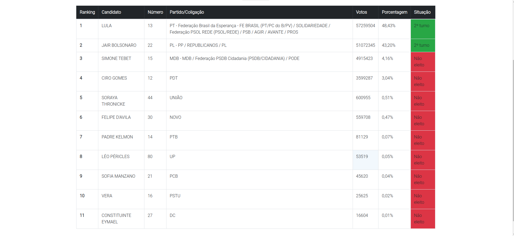

# Eleições Presidenciais 2022
## 1º Turno

Desenvolvido com
- [Node.js](https://nodejs.org/pt-br/)
    - [API do TSE](https://resultados.tse.jus.br/oficial/ele2022/544/dados-simplificados/br/br-c0001-e000544-r.json)
- [Bootstrap](https://getbootstrap.com.br/)
- [EJS](https://ejs.co/)
- [CSS](https://developer.mozilla.org/pt-BR/docs/Web/CSS)

### Como usar

Crie um clone em sua máquina, digite no terminal:
````
git clone https://github.com/fredcardoso191/eleicoes-2022.git
````
E entre na pasta
````
cd eleicoes-2022
````
Instale as dependências do projeto
````
npm install express ejs axios nodemon --save
````
Para executar o projeto, digite no terminal
````
npm start
````

Preview
